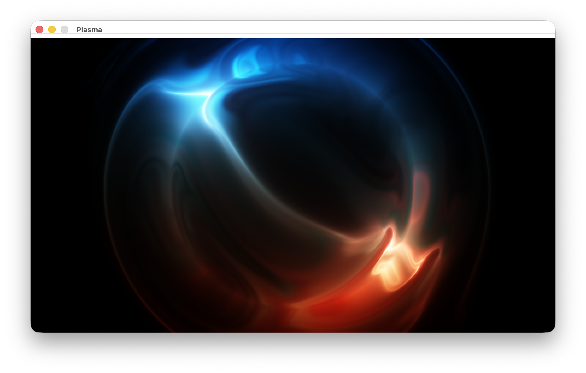

# Plasma

A real-time plasma effect visualization using raylib, converted from the original PPM image sequence generator.



**Video Demo**: See [`Video.mov`](Video.mov) for the full animation.

## Description

This project implements an animated plasma effect that creates mesmerizing, flowing patterns of color. The effect is rendered in real-time using raylib, providing smooth 60 FPS animation with a continuous looping cycle.

The original implementation generated 240 PPM image frames that could be compiled into a video. This version renders the same mathematical plasma effect directly to the screen using raylib's graphics API.

## Building

This project uses a [custom build system](https://github.com/RaphaeleL/build.h) based. To build:

```bash
# First, compile the build system (if not already compiled)
cc build.c -o build

# Then run the build system
./build
```

Keep in mind that the compilation is optimized for macOS with raylib 5.5 included in the repository. Adjustments may be needed for other platforms. However, it should be straightforward.

## Running

```bash
./plasma
```

The window will display the animated plasma effect. Close the window or press ESC to exit.

## Dependencies

- **raylib 5.5** (included in `raylib-5.5_macos/`)
- **C++ compiler** with C++11 support
- **macOS frameworks**: OpenGL, Cocoa, IOKit, CoreVideo

## Technical Details

The plasma effect uses vector mathematics and trigonometric functions to generate the visual patterns. The core algorithm:

- Uses `vec2` and `vec4` structures for efficient vector operations
- Applies trigonometric functions (`sin`, `cos`, `tanh`) to create wave patterns
- Combines multiple iterations to create complex, flowing effects
- Converts the mathematical output to RGB color values for display

The animation loops through a 240-frame cycle, creating a seamless continuous effect.

## Footnotes

- This Plasma Effect was invented by [XorDev](https://x.com/XorDev/status/1894123951401378051)
- The original implementation to generated a PPM based Video was implemented by [github.com/rexim](https://gist.githubusercontent.com/rexim/ef86bf70918034a5a57881456c0a0ccf/raw/d82ffbc6ccacb6a1fc3167b7f38c526f5e478103/plasma.cpp)
